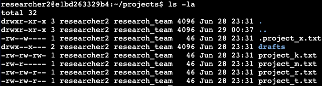
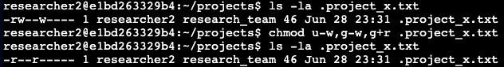

<h1>Using Linux commands to manage file permissions</h1>

<h2>Description</h2>
The project is to ensure users on this team are authorized with the appropriate permissions which helps keep the system secure. I will be examining existing permissions on the file system to determine if the permissions match the authorization that should be given. If they do not, I will modify the permissions to authorize the appropriate users and remove any unauthorized access using various Linux commands. 

<h2>Check file and directory details</h2>
Navigated to <i>projects</i> directory via: <i>cd projects</i>  
Entered: <i>ls -la</i> to list the files/subdirectories, including those hidden, and their permissions: 
 

<h2>Describe the permissions string</h2>
The Linux permissions string is a set of 10 characters. 
The following describes <i>the project_k.txt</i> file permissions string in the above screenshot:  
-rw-rw-rw- 
  
The first character will either be a d (for directory) or a dash (for a file).  
In that example, it’s a - for a file.  
 
The string is grouped in 3’s and indicative of: user permission, group permission, and other permission:  
User: 2nd, 3rd, 4th characters  
Group: 5th, 6th, 7th characters  
Other: 8th, 9th, 10th characters  
 

The first character in each group is the for the read permission, indicated by the letter r.   
If there is a -, the permission is not granted. (2nd, 5th, 8th characters)  

The second character in each group is for the write permissions, indicated by the letter w.  
If there is a -, the permission is not granted. (3rd, 6th, 9th characters)  

The third character in each group is for the execute permissions, indicated by the letter x.  
If there is a -, the permission is not granted. (4th, 7th, 10th characters)  
 

<h2>Change file permissions</h2>
As the organization does not allow other to have write access, the <i>project_k.txt</i> file is in violation.  
Changing it via: <i>chmod o-w project_k.txt</i>

<h2>Change file permissions on a hidden file</h2>
The <i>.project_x.txt</i> file was archived, which is why it’s hidden.  
It should not have write permissions for anyone, but the user and group should be able to read the file.

Changed permissions via: <i>chmod u-w,g-w,g+r .project_x.txt</i>

<h2>Change directory permissions</h2>
The files and directories in the projects directory belong to the <i>researcher2 user</i>.  
Only <i>researcher2</i> should be allowed to access the <i>drafts</i> directory and its contents.
  

Checked permissions via: <i>ls -la</i>  
  
Changed via: <i>chmod g-x drafts</i>  
  

<h2>Summary</h2>
Verified users on the team were authorized with the appropriate permissions. I examined existing permissions on the file system and modified the permissions to authorize the appropriate users and remove any unauthorized access using the following Linux commands:  
<i>ls -la</i> to check files/directory permissions, including hidden files, and chmod to change permissions for files/directories
